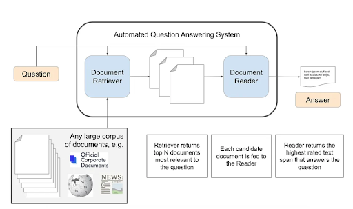
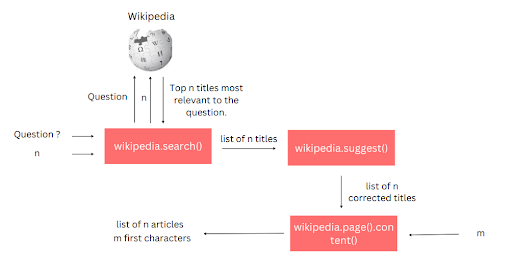
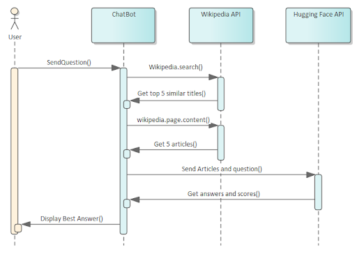

# Factoid Question Answering System


[](LICENSE)

## Introduction
The Factoid Question Answering System is an Open-domain Question Answering (ODQA) project that focuses on answering factoid questions in natural language.

Factoid questions are those seeking brief, factual information that can be easily verified. They typically require a yes or no answer or a brief explanation and often inquire about specific details such as dates, names, places, or events.

Examples of factoid questions include:

- What is the capital of France?
- What is the capital of Morocco?
- When was Wikipedia founded?
- ما هي وحدة قياس التيار الكهربائي؟
- ما هي عاصمة فرنسا؟
- ما هو الجبل الأعلى في العالم؟
- ما هو اللون الذي يرمز إلى السلام في العديد من الثقافات؟
- ما هو اسم العملة الرسمية لمصر؟
- ما هي الصيغة الكيميائية للماء؟

The Factoid Question Answering System utilizes a combination of Natural Language Processing (NLP) techniques and machine learning models to effectively process these factoid questions and generate accurate answers.

## System Architecture


## Document Retriever


## Document Reader


## Sequence Diagram


## Technologies Used
[List the key technologies, frameworks, and libraries used in the project. Mention the programming languages and any external APIs or tools integrated into the system.]

## Demo
You can experience the Factoid Question Answering System using the following links:

- [Arabic Version](https://question-answering-system-gs1p.onrender.com/Question_Answering_AR)
- [English Version](https://question-answering-system-gs1p.onrender.com/Question_Answering_EN)

Please feel free to try out the system with your factoid questions in both Arabic and English languages.

[Watch the Demo Video](fig/demo.mp4)

## Installation
To install the project, you can use the following command :

```bash
  git clone git@github.com:NechbaMohammed/Factoid-Question-Answering-System.git
```

## Contributing
We welcome contributions from the community. If you would like to contribute to this project, follow these steps:
1. Fork the repository.
2. Create a new branch for your feature or bug fix.
3. Make your changes and commit them with a descriptive commit message.
4. Push your changes to your branch.
5. Submit a pull request to the main repository.

We will review your contribution and merge it if it meets our guidelines and standards.

## License
This project is licensed under the MIT License - see the [LICENSE](LICENSE) file for details.

## Authors

👤 **Mohammed Nechba**

* LinkedIn: [@NechbaMohammed](https://www.linkedin.com/in/mohammed-nechba-926214225/)
* GitHub: [@NechbaMohammed](https://www.github.com/NechbaMohammed)

👤 **Mohamed Mouhajir**

* LinkedIn: [@mohamedmouhajir](https://www.linkedin.com/in/mohamed-mouhajir-90450a235/)
* GitHub: [@mohamedmouhajir](https://github.com/mohamedmohamed2021)

👤 **Yassine Sedjari**

* LinkedIn: [@yassinesedjari](https://www.linkedin.com/in/yassine-sedjari-4074aa189/)
* GitHub: [@yassinesedjari](https://github.com/Heyyassinesedjari)